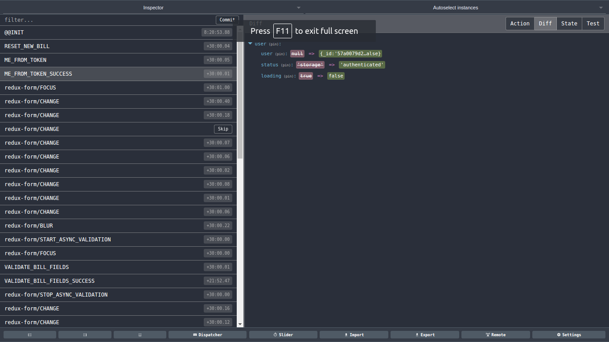
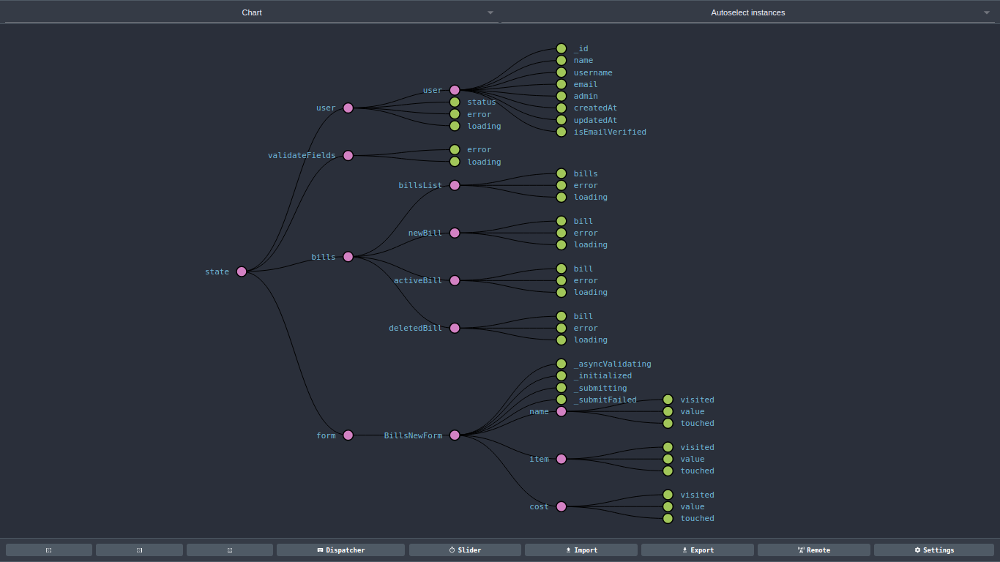
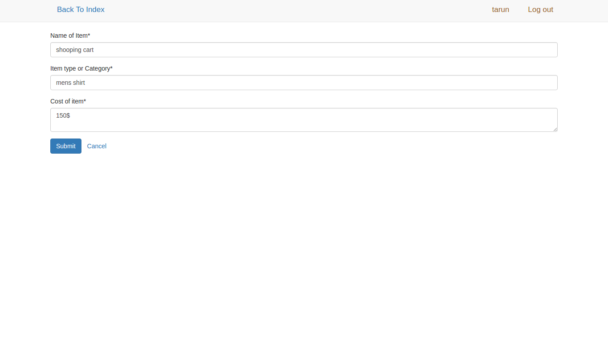
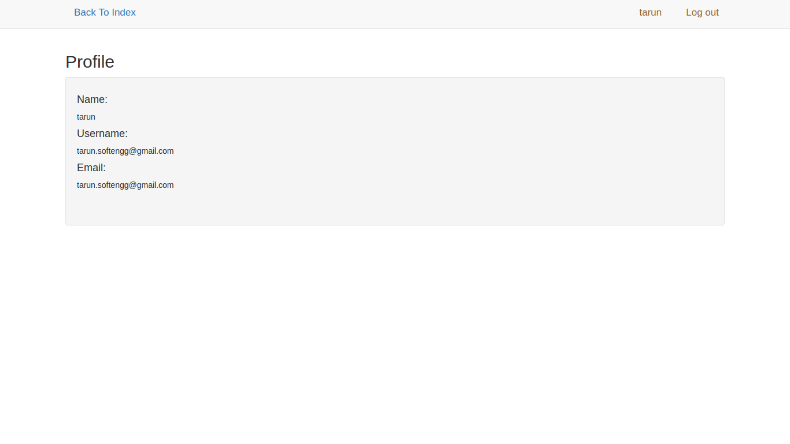
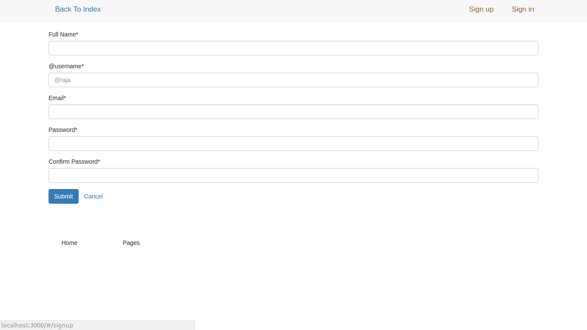
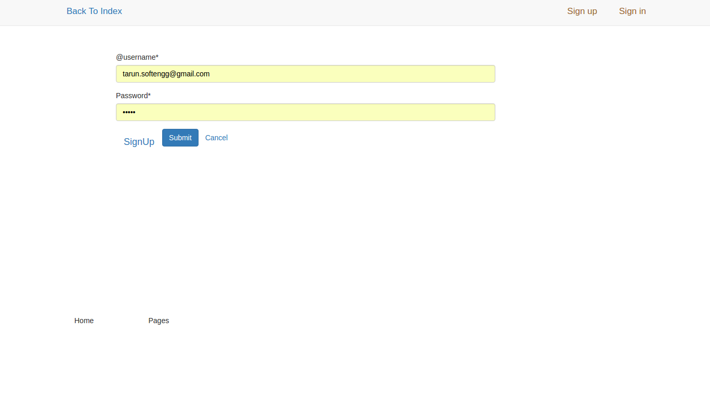

# Redux App with Node express Mongo DB + [Athena’s]

# Three Principles

Redux can be described in three fundamental principles:

### Single source of truth

**The [state](../Glossary.md#state) of your whole application is stored in an object tree within a single [store](../Glossary.md#store).**

This makes it easy to create universal apps, as the state from your server can be serialized and hydrated into the client with no extra coding effort. A single state tree also makes it easier to debug or introspect an application; it also enables you to persist your app's state in development, for a faster development cycle. Some functionality which has been traditionally difficult to implement - Undo/Redo, for example - can suddenly become trivial to implement, if all of your state is stored in a single tree.

```js
console.log(store.getState())

/* Prints
export const DELETE_BILL = 'DELETE_BILL';
export const DELETE_BILL_SUCCESS = 'DELETE_BILL_SUCCESS';
export const DELETE_BILL_FAILURE = 'DELETE_BILL_FAILURE';
export const RESET_DELETED_BILL = 'RESET_DELETED_BILL';


const ROOT_URL = location.href.indexOf('localhost') > 0 ? 'http://localhost:3000/api' : '/api';
export function fetchBills() {
  const request = axios.get(`${ROOT_URL}/bills`);

  return {
    type: FETCH_BILLS,
    payload: request
  };
}
*/
```

### State is read-only

**The only way to change the state is to emit an [action](../Glossary.md#action), an object describing what happened.**

This ensures that neither the views nor the network callbacks will ever write directly to the state. Instead, they express an intent to transform the state. Because all changes are centralized and happen one by one in a strict order, there are no subtle race conditions to watch out for. As actions are just plain objects, they can be logged, serialized, stored, and later replayed for debugging or testing purposes.

```js
const INITIAL_STATE = {user: null, status:null, error:null, loading: false};

export default function(state = INITIAL_STATE, action) {
  let error;
  switch(action.type) {
    
    case VALIDATE_EMAIL://check email verification token
    return { ...state, user: null, status:'validate_email', error:null, loading: true};
    case VALIDATE_EMAIL_SUCCESS:
    }
}
```

### Changes are made with pure functions

**To specify how the state tree is transformed by actions, you write pure [reducers](../Glossary.md#reducer).**

Reducers are just pure functions that take the previous state and an action, and return the next state. Remember to return new state objects, instead of mutating the previous state. You can start with a single reducer, and as your app grows, split it off into smaller reducers that manage specific parts of the state tree. Because reducers are just functions, you can control the order in which they are called, pass additional data, or even make reusable reducers for common tasks such as pagination.
Application setup
==============
- App require NPM Node installed 
- App is using Redux forms for formvalidations
- App is using Node as backend Express
- For login its using JWT 

```Javascript

or just add this package json
"devDependencies": {
    "babel-core": "^6.2.1",
    "babel-loader": "^6.2.0",
    "babel-preset-es2015": "^6.1.18",
    "babel-preset-react": "^6.1.18",
    "webpack": "^1.12.9",
    "webpack-dev-server": "^1.14.0"
  },
  "dependencies": {
    "async": "^1.5.2",
    "axios": "^0.9.0",
    "babel-preset-stage-1": "^6.1.18",
    "bcrypt": "^0.8.5",
    "body-parser": "~1.13.2",
    "cookie-parser": "~1.3.5",
    "debug": "~2.2.0",
    "ejs": "^2.4.1",
    "express": "~4.13.1",
    "express-jwt": "^3.3.0",
    "jade": "~1.11.0",
    "jsonwebtoken": "^5.7.0",
    "lodash": "^3.10.1",
    "mongoose": "^4.4.6",
    "mongoose-timestamp": "^0.5.0",
    "morgan": "~1.6.1",
    "postmark": "^1.2.1",
    "react": "^0.14.3",
    "react-dom": "^0.14.3",
    "react-redux": "^4.0.0",
    "react-router": "^2.0.0-rc5",
    "redux": "^3.0.4",
    "redux-form": "^4.1.3",
    "redux-logger": "^2.6.1",
    "redux-promise": "^0.5.1",
    "sendgrid": "2.0.0",
    "serve-favicon": "~2.3.0"
  }

// In webpack.config.js

var path = require('path');
var webpack = require('webpack');
var HtmlWebpackPlugin = require('html-webpack-plugin');

module.exports = {
  devtool: 'eval-source-map',
  entry: [
    'webpack-hot-middleware/client?reload=true',
    path.join(__dirname, 'src/index.js')
  ],
  output: {
    path: path.join(__dirname, '/dist/'),
    filename: 'build.js',
    publicPath: '/'
  },
  plugins: [
    new HtmlWebpackPlugin({
      template: __dirname + '/index.html',
      filename: 'index.html',
      inject: 'body'
    }),
    new webpack.optimize.OccurenceOrderPlugin(),
    new webpack.HotModuleReplacementPlugin(),
    new webpack.NoErrorsPlugin(),
    new webpack.DefinePlugin({
      'process.env.NODE_ENV': JSON.stringify('development')
    })
  ],
  module: {
    loaders: [
    {
      test: /\.jsx?$/,
      exclude: /node_modules/,
      loader: 'react-hot!babel'
    },
    // es linter
    //loader: 'react-hot!babel'
    {
      test: /\.js$/,
      exclude: /node_modules/,
      loaders: ['babel-loader']
    },
    //loaders: ['babel-loader', 'eslint-loader']
      // load js 
      { test: /\.less$/, loader: "style!css!autoprefixer!less" },
      // Load SCSS
      { test: /\.scss$/, loader: "style!css!autoprefixer!sass" },
      // Load plain-ol' vanilla CSS
      { test: /\.scss$/, loader: "style!css" }]
  }
};

```


React JS 
====================
<a name="README">[](https://github.com/kumartarun/React-JS-Starter-apps.git)</a>

Creating components
====================
```Javascript
// action crerators 
export const FETCH_BILL = 'FETCH_BILL';
export const FETCH_BILL_SUCCESS = 'FETCH_BILL_SUCCESS';
export const FETCH_BILL_FAILURE = 'FETCH_BILL_FAILURE';
export const RESET_ACTIVE_BILL = 'RESET_ACTIVE_BILL';

//Delete bill
export const DELETE_BILL = 'DELETE_BILL';
export const DELETE_BILL_SUCCESS = 'DELETE_BILL_SUCCESS';
export const DELETE_BILL_FAILURE = 'DELETE_BILL_FAILURE';
export const RESET_DELETED_BILL = 'RESET_DELETED_BILL';

const ROOT_URL = location.href.indexOf('localhost') > 0 ? 'http://localhost:3000/api' : '/api';
export function fetchBills() {
  const request = axios.get(`${ROOT_URL}/bills`);

  return {
    type: FETCH_BILLS,
    payload: request
  };
}

export function fetchBillsSuccess(bills) {
  return {
    type: FETCH_BILLS_SUCCESS,
    payload: bills
  };
}

export function fetchBillsFailure(error) {
  return {
    type: FETCH_BILLS_FAILURE,
    payload: error
  };
}
// reducers
import { combineReducers } from 'redux';
import BillsReducer from './reducer_bills';
import UserReducer from './reducer_user';
import ValidateUserFieldsReducer from './reducer_validateUserFields';
import { reducer as formReducer } from 'redux-form';
const rootReducer = combineReducers({
  user: UserReducer,
  validateFields: ValidateUserFieldsReducer,
  bills: BillsReducer, //<-- Bills
  form: formReducer // <-- redux-form
});

export default rootReducer;
//routes
export default (
  <Route path="/" component={App}>
    <IndexRoute component={BillsIndex} />
    <Route path="bills/new" component={BillsNew} />
    <Route path="bills/:id" component={BillsShow} />
    <Route path="/signin" component={SignIn} />
    <Route path="/signup" component={SignUp} />
    <Route path="/profile" component={Profile} />

  </Route>
  
import React from 'react';
import ReactDOM from 'react-dom';
import { Provider } from 'react-redux';
import { Router, hashHistory } from 'react-router';
import routes from './routes';
import configureStore from './store/configureStore.js';

const store = configureStore();

ReactDOM.render(
  <Provider store={store}>
    <Router history={hashHistory} routes={routes} />
  </Provider>
  , document.getElementById('body'));
```

Event Handeling
====================







Run the tutorial (each file is numbered)
====================
```Terminal
git clone https://github.com/kumartarun/React-redux-billApp.git
run node express server from root dir using
npm install &&  run npm start 
Now create webpack build for client side 
cd client
npm install
npm  run dev  // run webpack dev server on port 8080
npm run dev-build  // create build file
now see application on localhost post 3000
```

Contact
====================
[](http://gennexttraining.herokuapp.com/)
[](https://github.com/tkssharma)
[](mailto:tarun.softengg@gmail.com)
[](https://www.linkedin.com/in/tkssharma)
[](https://twitter.com/tkssharma)